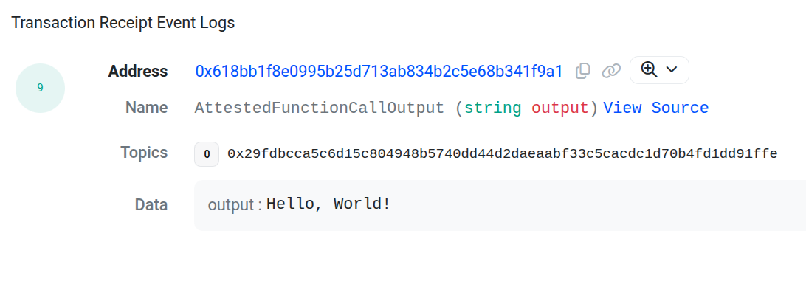

# Hello World - Bringing A Blocky AS Function Call Attestation On Chain

This example shows you how to bring a Blocky AS function call attestation
on chain. It builds on the 
[Hello World - Attesting a Function Call](../hello_world_attest_fn_call)
example, which shows you how to attest a WASM function.

In this example, you'll learn how to:

- Write a smart contract to verify and parse a function call attestation
- Test the smart contract locally
- Deploy the smart contract to Base Sepolia to verify a function call
  attestation on chain and use the attested function output in your smart
  contract

## Setup

Set up the project dependencies:

```bash
npm install --dd
```

## Quick Start

To run this example, call:

```bash
make test-local
```

which will test verifying an attested function call in 
[`contracts/User.sol`](contracts/User.sol) 
within a local test environment.

## Walkthrough

### Step 1: Attest a function call

In the [Hello World - Attesting a Function Call](../hello_world_attest_fn_call)
example we walked through a process of attesting a WASM function call. 
The result of that process was an `out.json` file containing the enclave attested 
application public key and a transitive attestation of the function call.
The contents of `out.json` have been verified by the Blocky AS CLI. 
To learn more about that process, revisit the
[Hello World - Attesting a Function Call](../hello_world_attest_fn_call)
example, or read about
[Attestations in the Blocky Attestation Service](https://blocky-docs.redocly.app/attestation-service/concepts#attestations-in-the-blocky-attestation-service)
in our documentation.

For this example, we have copied `out.json` from the previous example into
[`inputs/out.json`](inputs/out.json).
To verify the output of the WASM function call in a smart contract, we will
extract from `out.json` the transitive attestation of function call, as well as
the enclave attested application public key of the Blocky AS server. As you'll
see later, this example is driven by tests in
[tests/user.ts](test/user.ts). In that file, we use the `loadEVMLinkData`
function to extract the transitive attestation and enclave attested application
public key from [`inputs/out.json`](inputs/out.json). If you like, you can see
these values now by running:

```bash
jq -r '.function_calls[0].transitive_attestation' inputs/out.json
```
and

```bash
jq -r '.enclave_attested_application_public_key.public_key.data' inputs/out.json
```

### Step 2: Write a smart contract to verify a function call attestation

For this example, we have created user contract in 
[`contracts/User.sol`](contracts/User.sol).
Its goal is to verify that a transitive attestation has
been signed by the enclave attested application public key of the Blocky AS
server and parse out the attested function output. 

The first step in that process is to set the enclave attested application
public key, used to sign transitive attestations, in contract memory. We do this
by calling the `setTASigningKeyAddress` function:

```solidity
    address private taSigningKeyAddress;

    function setTASigningKeyAddress(
        bytes calldata taSigningKey
    )
    public onlyOwner
    {
        taSigningKeyAddress = publicKeyToAddress(taSigningKey);
    }
```

The `setTASigningKeyAddress` function uses 
[OpenZeppelin's Ownable contract](https://docs.openzeppelin.com/contracts/2.x/access-control#ownership-and-ownable)
to allow only the owner (publisher) of the [`User`](contracts/User.sol) contract
to set transitive attestation signing key in contract memory. This step is
important, since the owner is the one who obtained and verified the enclave
application public key using the `bky-as` CLI. For now, users of the 
[`User`](contracts/User.sol) contract have to trust the contract owner to set
the correct transitive attestation signing key. In the future, we will make this
process fully trustless, by allowing smart contracts to verify enclave
attestations directly to extract and set the transitive attestation signing key.

The [`User`](contracts/User.sol) contract uses the Blocky-provided
[`lib/TAParserLib.sol`](lib/TAParserLib.sol) library, which offers
several utility functions. One of these is `publicKeyToAddress` function
converts the enclave attested application public key to an Ethereum address.

The next step is to verify the transitive attestation. The
[`User`](contracts/User.sol) contract provides the `verifyAttestedFnCallClaims`
function:

```solidity
    function verifyAttestedFnCallClaims(
        string calldata taData
    )
    public
    {
        TAParser.FnCallClaims memory claims = parseTA(
            taData,
            taSigningKeyAddress
        );

        console.log("Verified attest-fn-call claims:");
        console.log("\tFunction: %s", claims.Function);
        console.log("\tHash of code: %s", claims.HashOfCode);
        console.log("\tHash of input: %s", claims.HashOfInput);
        console.log("\tHash of secrets: %s", claims.HashOfSecrets);
        console.log("\tOutput: %s", claims.Output);

        emit AttestedFunctionCallOutput(claims.Output);
    }
```

to verify a transitive attestation passed in as `taData`. The bulk of that work
takes place in [`TAParserLib.sol`](lib/TAParserLib.sol) `parseTA` function where
we decode `taData` and check that it is signed by `taSigningKeyAddress`.

At this point, you may want to extend the [`User`](contracts/User.sol)
contract `verifyAttestedFnCallClaims` function to do more than just print the
transitive attestation `claims` to the console. You may want to add additional
logic to verify the various `claims` fields to make sure that the transitive
attestation is over the function and inputs expected by your smart contract. You
may also take actions based on the output of the function to trigger further
smart contract logic.

In our [`User.sol`](contracts/User.sol) contract `verifyAttestedFnCallClaims`
function example, we simply print the `claims` to the console and emit an
`AttestedFunctionCallOutput` event with the `Output` field of the `claims`.

### Step 3: Test the `User` contract locally

To test the smart contract locally, we use the
[Hardhat](https://hardhat.org/) framework.
We define the `"Local Test"` in [`test/user.ts`](test/user.ts) that loads
[`inputs/out.json`](inputs/out.json), calls the `setTASigningKeyAddress`
and `verifyAttestedFnCallClaims` functions on the [`User`](contracts/User.sol)
contract, and checks that the contract emits the `AttestedFunctionCallOutput`
event with `"Hello, World!"` as input.

### Step 4: Deploy the Smart Contract to Base Sepolia

You can also deploy the [`User.sol`](contracts/User.sol) contract to Base
Sepolia testnet. To do so, we need to do a bit more setup:

- Create a wallet and fund it with Base Sepolia ETH.
  - If you'd like to user Metamask as your wallet, you can follow this
    [guide](https://getblock.io/blog/add-base-sepolia-testnet-metamask/)
    to configure it with Base Sepolia.
  - To fund your wallet, you can tap on of the Base Sepolia faucets listed in
      [Base Sepolia documentation](https://docs.base.org/chain/network-faucets).
- Set your wallet's private key in the [`.env`](.env) file under `WALLET_KEY`.
- Get a
  [Basescan API key](https://docs.basescan.org/getting-started/viewing-api-usage-statistics#creating-an-api-key)
- Set your Basescan API key in the [`.env`](.env) file under `BASESCAN_KEY`.

> Now you are ready to deploy and test the [ `User.sol`](contracts/User.sol) 
> contract on Base Sepolia. However, you can skip this step and go directly to
> [Step 5](#step-5-test-the-user-contract-on-base-sepolia) to test the
> [`User.sol`](contracts/User.sol) contract on Base Sepolia using
> deployed contract address in the
> [`deploymnets/user_deployed_address`](deployments/user_deployed_addressoyed_address)
> file.

To deploy the smart contract, call:

```bash
make deploy-base-sepolia
```

Notice the output of the command similar to: 

```
Successfully verified contract User on the block explorer.
https://sepolia.basescan.org/address/0x41BC1d75EB319573B8e3071e0C5B611eD458e21a#code
```

which includes a link to the 
[deployed `User` contract on Basescan](https://sepolia.basescan.org/address/0x41BC1d75EB319573B8e3071e0C5B611eD458e21a).

### Step 5: Test the `User` contract on Base Sepolia

To test the [`User.sol`](contracts/User.sol) contract on Base Sepolia, call:

```bash
make test-base-sepolia
```

which will invoke the `"Base Sepolia Tests"` in [`test/user.ts`](test/user.ts).
You will see the test output similar to:

```
  Base Sepolia Tests
    ✔ Set signing key (5510ms)
    ✔ Verify TA (2174ms)
```

which show that the [`User.sol`](contracts/User.sol) contract was able to
verify the TA in just over 2 seconds.
If you go to Basescan to see 
[contract transaction logs](https://sepolia.basescan.org/tx/0x82eb1d2cd500a1e236678a04f9ee8361e2fda11224d0791612ae2244d294bf78#eventlog)
you can see that the `verifyAttestedFnCallClaims` emitted the
`AttestedFunctionCallOutput` event containing the expected `"Hello, World!"` 
WASM function output.




## Next steps

Now that you have successfully run the example, you can start modifying it to
fit your own needs. Check out other examples in this repository, to learn what
else you can do with Blocky AS.
